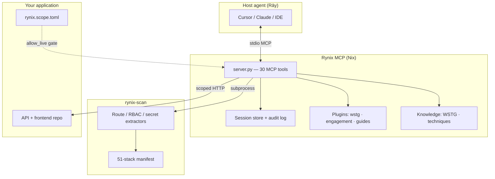

<div align="center">

**English** · [Persian / فارسی](README.fa.md)


# Rynix MCP

> **Rynix: Where ancient reasoning meets modern execution.**

**Local-first security MCP platform — Rust static analyzer (`rynix-scan`) + Python MCP host (`rynix-mcp`).**

[](LICENSE)
[](mcp-server/pyproject.toml)
[](rynix-core/Cargo.toml)
[](#mcp-tools-30)
[](#running-tests)
[](#knowledge-base)

- **Rāy (رای):** Cursor / IDE agent reasoning
- **Nix:** MCP tools, probes, reports — **no external LLM API keys**

</div>

---

## Table of Contents

<details open>
<summary><strong>Jump to section</strong></summary>

- [What is Rynix MCP?](#what-is-rynix-mcp)
- [Why use it?](#why-use-it)
- [Architecture](#architecture)
- [MCP tools (30)](#mcp-tools-30)
- [Quick start](#quick-start)
- [Cursor MCP config](#cursor-mcp-config)
- [Target application workflow](#target-application-workflow)
- [Plugins (runtime parity)](#plugins-runtime-parity)
- [Knowledge base](#knowledge-base)
- [Profiles & multi-stack](#profiles--multi-stack)
- [Verification & QA](#verification--qa)
- [Project structure](#project-structure)
- [Environment variables](#environment-variables)
- [Honest limitations](#honest-limitations)
- [FAQ](#faq)
- [Documentation index](#documentation-index)
- [Contributing](#contributing)
- [License](#license)

</details>

---

## What is Rynix MCP?

**Rynix MCP** is a **local-first security platform** that connects to your IDE (Cursor, Claude Desktop, etc.) via the [Model Context Protocol](https://modelcontextprotocol.io/). The host agent reasons; Rynix executes:

| Layer | Component | Role |
|-------|-----------|------|
| **Static** | `rynix-scan` (Rust) | Route extraction, RBAC hints, secret patterns, taint sinks |
| **Active** | `rynix-mcp` (Python) | Scoped HTTP probes, dual-token IDOR matrix, auth, SARIF export |
| **Knowledge** | Bundled playbooks | WSTG 109 · technique guides · vuln-class catalog |
| **Plugins** | Sidecar runners | WSTG orchestrator, engagement guard, agent guides, template-scan |

```text
+------------------+       MCP (stdio)        +---------------------------+
|  Host agent      | <----------------------> |  rynix-mcp (Python)       |
|  (Cursor / IDE)  |   30 tools + playbooks   |  sessions · probes · SARIF|
+------------------+                          +-------------+-------------+
                                                            |
                                                            v
                                              +-------------+-------------+
                                              |  rynix-scan (Rust)        |
                                              |  static analysis binary   |
                                              +---------------------------+
```

> [!NOTE]
> Rynix does **not** call external LLM APIs. Your IDE agent provides reasoning; Rynix provides tools, evidence, and guardrails.

---

## Why use it?

| Problem | Rynix solution |
|---------|----------------|
| Pentest notes scattered across chats | Session-scoped findings, audit log, `export_report` → JSON / Markdown / SARIF |
| IDOR testing is manual and slow | `run_idor_matrix` — dual-token comparisons with profile-aware role pairs |
| Static + dynamic disconnected | `analyze_repo` → `generate_pentest_brief` → live probes in one MCP session |
| Scope creep on live targets | Default-deny `scope_check` + per-repo `rynix.scope.toml` |
| Vendor lock-in to cloud scanners | Fully local; credentials via env only; MIT licensed |
| Agent needs methodology depth | Bundled WSTG 109 + 31 technique guides + agent engagement playbook |
| Multi-framework repos | 182 stacks in `stacks/manifest.toml` with Tier-1 dedicated extractors |

---

## Architecture



**Design principles** (see [docs/MCP_DESIGN.md](docs/MCP_DESIGN.md)):

1. **Default-deny scope** — `scope_check` before any live probe.
2. **Session evidence** — findings keyed by `session_id`; export to `pentest_output/`.
3. **Plugin parity** — sidecars merge into the same session + SARIF.
4. **Agent-native** — no second LLM; host agent chains tools (see [docs/AGENT_NATIVE.md](docs/AGENT_NATIVE.md)).

---

## MCP tools (30)

| Group | Tools |
|-------|--------|
| **Static (8)** | `analyze_repo`, `list_api_routes`, `list_frontend_routes`, `rbac_matrix`, `high_risk_surfaces`, `generate_pentest_brief`, `list_profiles`, `health_check` |
| **Active (10)** | `scope_check`, `http_probe`, `auth_login`, `unlock_stealth_gate`, `check_access`, `compare_role_response`, `record_finding`, `export_report`, `export_openapi_stub`, **`run_idor_matrix`** |
| **Engagement (6)** | `register_scope`, `track_wstg_test`, `track_probe_step`, `save_engagement_context`, `get_engagement_context`, `list_engagement_progress` |
| **Knowledge (2)** | `get_technique_guide`, `get_wstg_test` |
| **Playbook (1)** | `agent_engagement_playbook` |
| **Plugins (3)** | `list_plugins`, `plugin_health_check`, `rynix_plugin_run` |

**Typical engagement flow:**

```text
health_check → analyze_repo → generate_pentest_brief
→ register_scope → scope_check → agent_engagement_playbook
→ auth_login → run_idor_matrix(allow_live=true)
→ record_finding(verified=True) → export_report
```

---

## Quick start

```powershell
git clone <your-fork>/rynix-mcp.git
cd rynix-mcp
.\scripts\build.ps1
.\scripts\verify.ps1
```

**Linux / macOS:**

```bash
git clone <your-fork>/rynix-mcp.git
cd rynix-mcp
cd rynix-core && cargo build --release && cd ..
cd mcp-server && uv sync && cd ..
python scripts/final_verify.py
```

Optional template scanner binary (CVE template scans):

```powershell
.\scripts\install-template-scan.ps1
# Then in MCP env: "RYNIX_TEMPLATE_SCAN_BIN": "${workspaceFolder}/bin/template-scan"
```

---

## Cursor MCP config

Use `cursor.posix.json` (macOS/Linux) or `cursor.windows.json` (Windows) — both use `${workspaceFolder}` (no machine-specific paths).

Copy `cursor-mcp.example.json` → your user MCP config and adjust if needed.

After code changes: `.\scripts\build.ps1` then **Restart** MCP in Cursor.

---

## Target application workflow

Per-repo files in **your application** (not in rynix-mcp):

- `rynix.scope.toml` — `live_probe=false` until `allow_live=true` on probes
- `.pentest/profile.toml` — scope/brief/profile name override

```text
health_check → analyze_repo → generate_pentest_brief
scope_check → run_idor_matrix(base_url="http://127.0.0.1:8001", allow_live=true, session_id="audit-1")
export_report → pentest_output/.../evidence/
```

Credentials via env only (never commit):

```powershell
$env:RYNIX_TARGET_REPO="C:\path\to\your-app"
$env:RYNIX_PROFILE="example-law-firm"   # or generic-fastapi-react
$env:RYNIX_PROBE_PASSWORD="..."
$env:RYNIX_PROBE_BASE_URL="http://127.0.0.1:8001"
uv run --directory mcp-server python ..\scripts\live_idor_matrix.py
```

See [docs/GITHUB_PUBLISHING.md](docs/GITHUB_PUBLISHING.md) for the full env var table.

---

## Plugins (runtime parity)

| Plugin | Strategy | Status |
|--------|----------|--------|
| `template-scan` | binary wrap | CVE templates (needs `RYNIX_TEMPLATE_SCAN_BIN`) |
| `wstg` | native + docker | 109 WSTG checklist |
| `engagement` | Rynix-native | scope guard, validate, scopes |
| `sarif-import` | native | SARIF merge into session |
| `agent-guides` | host-agent | technique guides + playbook |
| `pipeline-runner` | host-agent | recon→analyze→exploit→report stages |
| `cyber-range` | host-agent | bench scenarios + trajectory log |
| `whitebox-scan` | host-agent | static queue → exploit validation |
| `agent-orchestrator` | host-agent | disabled by default |
| `browser-debug` | host-agent | disabled by default |

```text
rynix_plugin_run("engagement", options='{"action":"check","url":"http://127.0.0.1:8001"}')
rynix_plugin_run("engagement", options='{"action":"scopes"}')
rynix_plugin_run("agent-guides", options='{"action":"playbook","scan_mode":"quick"}')
```

See `parity_matrix.toml` and [docs/HOST_AGENT_RUNTIME.md](docs/HOST_AGENT_RUNTIME.md).

---

## Knowledge base

Bundled under `mcp-server/rynix_mcp/knowledge/`:

| Catalog | Count | Notes |
|---------|-------|-------|
| **WSTG** | 109 tests | Full OWASP WSTG checklist markdown |
| **Techniques** | 31+ topics | Preferred source for overlapping vuln topics |
| **Vuln classes** | 42 guides | Agent-guides methodology ported in-tree |
| **Frameworks** | 33 deepdives | Per-framework guides in `knowledge/frameworks/` |

WSTG 109 · technique 31 · vuln-classes catalog (technique preferred for overlapping topics)

---

## Profiles & multi-stack

**Bundled profiles:**

- `profiles/generic-fastapi-react.toml`
- `profiles/example-law-firm.toml`
- `examples/example-law-firm/engagement-mirror.yaml`

**Multi-stack detection:** `stack_detect.py` + `stacks/manifest.toml` — **51 frameworks** with Tier-1 dedicated extractors in `rynix-scan`.

---

## Verification & QA

### Fast verify (local)

```powershell
.\scripts\verify.ps1          # G1–G9
python scripts\run_contract.py
python scripts\final_verify.py
python scripts\mcp_self_audit.py
```

### Full QA gateway

```powershell
.\scripts\qa.ps1              # ruff + mypy + pylint + pytest + rust + final_verify
# or
python scripts\run_qa.py        # lint + typecheck + unit tests + compileall
python scripts\final_verify.py  # 12 DoD gates (brands, leaks, knowledge, golden jury, …)
```

| Gate | Script | Purpose |
|------|--------|---------|
| G1–G9 | `verify.ps1` | cargo test, pytest, MCP self-audit, contract |
| QA | `run_qa.py` | ruff, mypy, pylint, pytest, rust, compileall |
| DoD | `final_verify.py` | 12 definition-of-done gates + full pytest |
| Publish | `verify_github_publish_ready.py` | No private paths / competitor brands |

**CI:** `.github/workflows/rynix-verify.yml` runs `run_qa.py` + `final_verify.py` on Linux and Windows.

---

## Project structure

```text
rynix-mcp/
├── assets/                 # Logo (rynix_logo_256.png)
├── docs/                   # Architecture, onboarding, publishing, CWE matrix
├── examples/               # example-law-firm mirror + probe-accounts.example.json
├── mcp-server/
│   ├── rynix_mcp/          # MCP host package (server.py, plugins, knowledge)
│   └── tests/              # 149 pytest tests (3 optional live E2E)
├── plugins/                # Plugin manifests + runners
├── profiles/               # Stack / engagement TOML profiles
├── rynix-core/             # Rust static analyzer (rynix-scan)
├── schemas/                # JSON schemas for scan results
├── scripts/                # build, verify, QA, engagement operators
├── stacks/                 # 51-framework manifest
├── cursor.windows.json     # Cursor MCP config (Windows)
├── cursor.posix.json       # Cursor MCP config (macOS/Linux)
└── parity_matrix.toml      # Plugin runtime parity map
```

---

## Environment variables

| Variable | Purpose |
|----------|---------|
| `RYNIX_TARGET_REPO` | Path to the application repo for scope/live gates |
| `RYNIX_PROFILE` | Default profile (`generic-fastapi-react` or `.pentest/profile.toml`) |
| `RYNIX_PROBE_PASSWORD` | Mirror/staging test user password |
| `RYNIX_PROBE_BASE_URL` | Target base URL |
| `RYNIX_PROBE_ACCOUNTS_FILE` | JSON probe accounts (see `examples/probe-accounts.example.json`) |
| `RYNIX_TEMPLATE_SCAN_BIN` | Optional template-scan binary |
| `RYNIX_STEALTH_GATE_SECRET` | When profile defines `[stealth.gate]` |

Full table: [docs/GITHUB_PUBLISHING.md](docs/GITHUB_PUBLISHING.md)

---

## Honest limitations

| Topic | Reality |
|-------|---------|
| Live probes | Require explicit `allow_live=true` + in-scope host; default is deny |
| Browser automation | `browser-debug` plugin disabled by default; Playwright optional |
| Template CVE scans | Need separate `template-scan` binary install |
| Production targets | Prefer local mirror / staging; use stealth gate only when configured |
| LLM reasoning | Provided by **your** IDE agent — Rynix does not include one |
| Windows MCP | Use dedicated venv interpreter in config (not `uv run` on reconnect) |

---

## FAQ

**Does Rynix send code to the cloud?**  
No. Static analysis and probes run locally. Only your IDE agent may use its own LLM.

**Can I pentest production?**  
Only with explicit scope config, credentials in env, and organizational authorization. Default posture is deny.

**How do I add a new stack profile?**  
Add `profiles/your-stack.toml`, optional `knowledge/frameworks/your-stack.md`, and register in `stacks/manifest.toml`.

**Where do reports go?**  
`pentest_output/<session_id>/` — gitignored by default.

More: [docs/FAQ.md](docs/FAQ.md)

---

## Documentation index

| Document | Description |
|----------|-------------|
| [README.fa.md](README.fa.md) | Persian README |
| [docs/ONBOARDING.md](docs/ONBOARDING.md) | First engagement walkthrough |
| [docs/MCP_DESIGN.md](docs/MCP_DESIGN.md) | Tool groups & integration patterns |
| [docs/AGENT_NATIVE.md](docs/AGENT_NATIVE.md) | Host-agent architecture |
| [docs/GITHUB_PUBLISHING.md](docs/GITHUB_PUBLISHING.md) | Safe publish checklist |
| [docs/HOST_AGENT_RUNTIME.md](docs/HOST_AGENT_RUNTIME.md) | Plugin runtime parity |
| [docs/CWE_MATRIX.md](docs/CWE_MATRIX.md) | CWE coverage map |
| [docs/LOGO_PROMPT.md](docs/LOGO_PROMPT.md) | Logo generation prompt |
| [CONTRIBUTING.md](CONTRIBUTING.md) | How to contribute |
| [CHANGELOG.md](CHANGELOG.md) | Release history |

Full index: [docs/INDEX.md](docs/INDEX.md)

---

## Contributing

Bug reports, docs, and tested PRs welcome. See [CONTRIBUTING.md](CONTRIBUTING.md).

```powershell
.\scripts\qa.ps1    # before opening a PR
```

---

## License

MIT — see [LICENSE](LICENSE).
